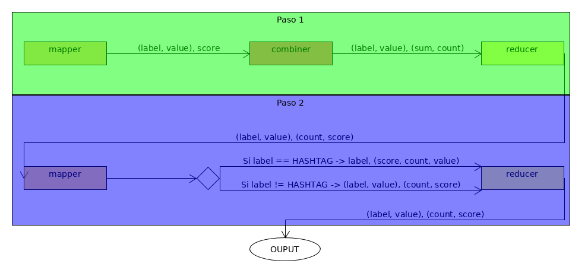

\newpage

# Introducción

En esta práctica se va a realizar un análisis de los sentimientos de los usuarios de Twitter. Para ello se va a atacar la API que ofrece Twitter para descargar tweets y Hadoop como tecnología a la hora de procesar los datos.

Los datos con los que se va a trabajar han sido recolectados durante varios dias, del día 6 de diciembre hasta el día 25 de ese mismo mes, y filtrando únicamente aquellos geolocalizados en Estados Unidos y España (incluyendo las islas). Aunque los datos recolectados incluyen ambos paises, el análisis se va a realizar únicamente sobre aquellos tweets procedentes de España.

Con estos datos podremos analizar la felicidad reflejada en twitter por los usuarios diferenciando entre:

* Región
* Fecha del tweet.
* Hora del tweet.
* Top 10 de hashtag.

# Análisis

## Recoleción de datos

Para la recoleción se va a utilizar una Raspberry Pi 3 (a parir de aquí RP) como dispositivo hardware con un HDD externo para almacenar los datos. Sobre este dispositivo se ejecutará un contenedor docker donde se ejecturá un script escrito en Bash, que a su vez, ejecuta un script escrito en Python que es el que realiza las llamadas a la API de twitter. 

La imagen docker ha sido cunstruida y subida al hub oficial de Docker para que pueda ser usada por cualquier usuario y también para poder ser distribuida al servidor donde va a ser ejecutada, la RP en este caso. Para ejecutar el docker es necesario indicar las siguientes variables de entorno:

* ACCESS_TOKEN_KEY, ACCESS_TOKEN_SECRET, CONSUMER_KEY y CONSUMER_SECRET: Claves para identificarse contra la API de twitter.
* SLEEP_TIME: Tiempo de espera entre ejecuciones del script de Python. Se explica más adelante.
* MAX_TWEETS_PER_BATCH: Número de tweets por fichero. 
* LOCATION_FILTER: Coordenadas utilizadas para filtrar los tweets. Estas coodenadas deberán seguir el formato que define Twitter (ver https://developer.twitter.com/en/docs/tutorials/filtering-tweets-by-location). 

Además también se define un VOLUME donde se almacenan los tweets descargados:

* /output

La ejecución del script de Python, que es el encargado de "atacar" la API de Twitter, se realiza a través de un script Bash con un bucle infinito. Tras MAX_TWEETS_PER_BATCH tweets descargados, el script de Python (twitterstream.py) finaliza y el script de Bash (run.sh) espera SLEEP_TIME segundos hasta una nueva ejecución. El resultado de la ejecución de twitterstream.py es volcado a la salida estandar, la cual run.sh redirecciona a un fichero. Por tanto, cada ejecución de twitterstream.py genera un fichero nuevo con los datos. Esto también facilitará la subida al servicio S3 de Amazon, donde se realizará el procesamiento, como se verá en el siguiente punto.

## Procesamiento

Para el procesamiento se utilizará el paquete para Python MRJob (https://mrjob.readthedocs.io/en/latest/). Este paquete facilita de forma significativa tanto la programación como ejecución de nuestra aplicación.

Dado que el análisis se va a realizar según diferentes criterios (fecha, región, ...), y que todos estos cálculos se quiere que se realicen en un único procesamiento, se utilizarán etiquetas (labels) para indicar a que criterio responde cada resultado:

* DATE_LABEL: 'DATE'                                                             
* HASHTAG_LABEL: 'HASHTAG'                                                       
* HOUR_LABEL: 'HOUR'                                                             
* REGION_LABEL: 'REGION'

También se ha definido una etiqueta, ERROR_LABEL, donde se contabilizará aquellos tweets que por alguna de las siguientes razones no haya podido ser utilizado:

* UNKNOW_REGION_ERROR: No se ha podido definir la región desde donde se ha creado el tweet.
* NOT_SCORED_TEXT_ERROR: El texto del tweet no contine palabras sobre las que medir la felicidad.
* OTHER_ERROR: Error no abarcado por los anteriores.

Junto con la etiqueta, la key estará formada por un valor que será:

* Si la etiqueta es 'HOUR', el valor será la hora a la que se escribio el tweet.
* Si es 'DATE', el valor será la fecha con un formato YYYYMMDD.
* Si es 'REGION', el valor será la CCAA desde donde se escribio.
* Si es 'HASHTAG', el valor es el propio hashtag.
* Si es 'ERROR', el valor será alguno de los definidos en el párrafo anterior.

Para cada una de las combinaciones anteriores, etiqueta + valor, se calculará un contador y la media del valor de felicidad (este último valor será 1, para mantener el formato de los datos aún no pudiendo ser calculado).

El procesamiento se realizará en dos pasos. En el primero se calcula tanto el contador como la media del valor de felicidad. En el segundo paso, se extraen, si es necesario, solo aquellos cuyo nivel de felicidad esté entre los más altos. En esta práctica se ha extraido el top 10 de aquellos valores etiquetados como HASHTAG. El siguiente diagrama muestra el flujo entre mappers y reducers y entre pasos:
```{r, echo=FALSE}
library(knitr)

```

* Paso 1: En este paso se lleva un conteo del número de tweets analizados por key y se calcula la media de felicidad de ellos.
  + Mapper: Analiza el tweet y calcula su puntuación. Retorna como key la tupla de label y value que le corresponde al tweet y la media de felicidad calculada para el tweet. Esto lo devuelve una vez para por cada criterio y por cada hashtag.
  + Combiner: Para aligerar el tráfico de datos entre mapper y reducer y aliviar el procesamiento en este último, se utiliza el combiner para sumar los score y contar el número de estos. No se realiza en este punto el cálculo de la media ya que para ello necesitariamos tener los datos el sistema en global.
  + Reducer: Recibe la suma de puntuaciones y el número de ellos desde los diferentes combiners, y con estos datos, calcula la media y el conteo total, siendo esto lo que devuelve.

* Paso 2: En este paso se filtran solo aquellos key con la puntuación más alta. Esto solo se realiza para un único criterio, el de HASHTAG.
  + Mapper: Su única labor es cambiar el formato de los datos que le llegan por la entrada según estos sean o no un hashtag.
  + Reducer: Si la key contine una etiqueta a la cual se le aplique el filtro (en el caso tratado solo 'HASHTAG'), devuelve solo aquellos cuyo score sea más alto. En caso contrario, lo devuelve sin más.

## Resultado

Al final del prceso tendremos como resultado un CSV con cuatro columnas:

* 1º: La etiqueta que define el críterio al que aplica dicha fila.
* 2º: El valor.
* 3º: El número de tweets que aplican a ese valor.
* 4º: La puntuación media.

Una pequeña muestra de este fichero:

DATE,20171218,21129,6.04687548145	
HOUR,13,22113,6.02709028087	
HOUR,5,2381,6.0608848423	
REGION,Galicia,17303,6.09286223831

# Código

El código implementado para realizar la práctica a sido: run.sh y twitterstream.py para la recolección de tweets, y twitter_feelings.py para el procesamiento.

## twitterstream.py

Este script esta basado en el proporcionado para la realización de práctica añadiendole algunas modificaciones para que permita la entrada de parámetros como el número de tweets a capturar o la localización.

## run.sh

Script que ejecuta el contenedor de docker y que únicamente está formado por un bucle infinito que ejecuta el script anterior redireccionando la salida a un fichero, espera que termine y "duerme" el tiempo indicado por SLEEP_TIME y vuelve a empezar.

## twitter_feelings.py

En este fichero se encuentra el código encargado de realizar el procesamiento. Como se ha dicho en la introdución, se hace uso del paquete mrjob, heredando de una de las clases que este implementa MRJob. Además de la clase que hereda de MRJob, se han implementando otras que se utilizan como herramientas. En total las clases con las que nos encontramos son:

* RegionByTown: Esta clase tiene como atributo un diccionario cuyos indices son los municipios españoles (alguno duplicado por si varia según el idioma, español, catalán, euskera, ...) y los valores son la CCAA a la que pertenece. Este diccionario se puebla utilizando un fichero binario .pickle que se pasa a MRJob a la hora de ejecutar. Esta clase admite como parametro a la hora de llamarla el nombre de un municipio y devuelve la CCAA correspondiente.
* TextFeeling: Al igual que la anterior clase, esta dispone de un diccionario como atributo que almacena el valor de felicidad asignado a a cada palabra. Este diccionario se puebla del mismo modo que lo hace la clase RegionByTown, a través de un fichero binario. Al llamarla acepta como parámetro un string y devuelve la puntuacioón media de este según las palabras que lo forman.
* MyOutputProtocol: Clase que implementa el método write y que se utiliza como OUTPUT_PROTOCOL del nuestro MRJob. Este método acepta como entrada la salida del reducer y devuelve un string formateado listo para el CSV final.
* MyJob: Clase que hereda de MRJob y que implementa los mappers y los reducers.

# Ejecución

La ejecución se ha realizado utilizando las opciones que ofrece MRJob sobre el servicio EMR de Amazon.

Indicar que en una primera ejecución se intento filtrar los tweets procedentes de España utilizando el comando grep en la opción mapper_pre_filter del Step 1 de MRJob. Esto funcionaba en bien en los test realizados en local, pero a la hora de ejecutarlo en Amazon, producía un error. 

Se decidio por tanto realizar este filtrado directamente en el mapper del paso 1. Como consecuencia, y dado que la conversión de texto a JSON es costosa, el tiempo de procesamiento era considerable. Así que para realizar la comparativa entre distintas configuraciones de clustter, se utilizo un conjunto de datos previamente filtrados. El resultado obtenido en todas las pruebas es siempre el mismo.

Para la ejecución se subieron los datos a un bucket en S3. El comando utilizado fue el siguiente:

python twitter_feeling.py --archive pickles.tar.gz#pickles -r emr s3://<bucket>/<input-path> --output-dir=s3://<bucket>/<output-path> --no-output --conf-path <mrjob-config-file>

Se puede ver que los pickles con las regiones y las palabras se subieron empaquetados en un fichero .tar.gz utilizando la opción --archive. También indicamos la ruta al fichero de configuración ya que este será diferente según la configuración del cluster que queramos.

## Datos sin filtrar

Como se ha comentado, en una primera ejecución se procesaron todos los datos filtrando aquellos geolocalizados en España directamente en el mapper. El clustter utilizado y el tiempo empleado fue:

* Instancia maestra: 1 * m1.medium
* Instancias core: 4 * m1.large
* Tiempo de ejecución: 177 minutos

## Datos filtrados

En esta prueba los datos ya estaban filtrados, lo que redujo notablemente el número de muestas (solo un 7% aproximadamente de muestras estaban geolocalizadas en España). Con tiempos de procesamiento mas manejables, se probaron 3 configuraciones de clustter.

Cluster 1:

* Instancia maestra: 1 * m1.medium
* Instancias core: 4 * m1.large
* Tiempo de ejecución: 25 minutos

Cluster 2:

* Instancia maestra: 1 * m1.medium
* Instancias core: 2 * m1.large
* Tiempo de ejecución: 34 minutos

Cluster 3:

* Instancia maestra: 1 * m1.medium
* Instancias core: 4 * m1.medium
* Tiempo de ejecución: 47 minutos

Por último, y como apunte curiosos, decir que el coste de todo esto en Amazon ha sido:

* EMR + EC2: 5.37€
* S3: 0.11€

# Resultados

La recolección de datos se llevo a cabo durante 21 dias, filtrando aquellos datos geolocalizados en el area de EEUU y de España. El filtro, al tratarse de un área cuadrada también abarcaba zonas de otros paises como Méjico, Francia, Portugal, ...

En total se han recolectado 97 GB de datos. De estos, 6.8GB o 1721901 procedían de España y son los que se han tenido en cuenta para realizar el análisis.

A continuación se muestran los datos obtenidos según los diferentes criterios vistos en la introducción.

## Según región
```{r, echo=FALSE, warning=FALSE, message=FALSE}
require(dplyr)
library(readr)
output <- read_csv("./ejecuciones/filtered_tweets_3/output/output.csv", col_names = FALSE)
colnames(output) <- c("ETIQUETA", "VALOR", "CONTADOR", "PUNTUACIÓN")
output$PUNTUACIÓN <- as.numeric(as.character(output$PUNTUACIÓN))
region.df <- output %>% filter(ETIQUETA=='REGION')
kable(region.df %>% arrange(VALOR))
```


```{r, echo=FALSE, warning=FALSE, message=FALSE}
require(ggplot2)
ggplot(region.df, aes(x=VALOR, y=PUNTUACIÓN, group=1)) + geom_bar(position="dodge",stat="identity") +coord_flip() 
```

Se aprecia poca diferencia entre regiones, siendo Extremadura la que mayor puntuación a obtenido. Todas las regiones, a excepción de Ceuta, supera 6.

## Por fecha

```{r, echo=FALSE}
date.df <- output %>% filter(ETIQUETA=='DATE')
date.df$VALOR <- as.Date(date.df$VALOR, '%Y%m%d')
kable(date.df %>% arrange(VALOR))
```


```{r, echo=FALSE}
ggplot(date.df, aes(x=VALOR, y=PUNTUACIÓN, group=1)) + geom_line()
```

Estos datos son bastante interesantes ya que más o menos la gráfica es como se esperaba.

Se aprecia el bajón que hay juesto después del puente de diciembre, siendo el miercoles 13 el día con una puntuación más baja.

También podemos ver como el día 20 se produce un máximo local y despues una fuerte caida el día 22. Esto puede deberse a dos motivos: las elecciones catalanas y la lotería de navidad.

Por último, y como era de esperar, el día 24 y 25 son los días con mayor puntuación. 

## Por hora

```{r, echo=FALSE}
hour.df <- output %>% filter(ETIQUETA=='HOUR')
hour.df$VALOR <- as.numeric(hour.df$VALOR)
kable(hour.df %>% arrange(VALOR))
```


```{r, echo=FALSE}
ggplot(hour.df, aes(x=VALOR, y=PUNTUACIÓN, group=1)) + geom_line()
```

Al igual que ocurre con los datos por fecha, la gráfica resultante se acerca bastante a lo esperado.

El mínimo se produce a la hora a la que la gente se suele levantar para ir a trabajar. Se aprecian también picos de felicidad en horas más o menos reconocibles del día como la hora del desayuno, la de la comida y la de la salida del trabajo.

Resulta curioso que el máximo se produzca durante la noche, pero al no haber distingido entre días festivos y laborales (podría ser una buena mejora), podemos pensar que la mayoría de tweets de esas horas pertenecen a días festivos, y por tanto, días de mayor felicidad.

## Top 10 de hashtags

```{r, echo=FALSE}
hashtag.df <- output %>% filter(ETIQUETA=='HASHTAG')
kable(hashtag.df %>% arrange(desc(PUNTUACIÓN)))
```

En este caso los datos son poco significativos ya que se filtraron hastags que al menos aparecían en 2 tweets. A la vista de los resultados, este filtro debería haber sido mayor para eliminar aquellos hashtags poco utilizados.

## Errores
```{r, echo=FALSE}
error.df <- output %>% filter(ETIQUETA=='ERROR')
kable(error.df %>% arrange(desc(CONTADOR)) %>% select(-PUNTUACIÓN))
```

Vemos que una gran cantidad de tweets, cerca del 78%, no han podido ser puntuados. Posibles motivos de esto son:

* Errores de codificación de algunos caracteres.
* Limitado número de palabras con valor asignado.
* Palabras mal escritas (cambios de b por v, acentos, ausencia de h, acortamiento de palabras, ...)

En cuanto a tweets a los que no se han podido asignar una region, representan solo el 2% de los tweets puntuados. Se podría implementar mecanismos para la localización de estos tweets utilizando servicios de tercero, pero debido al bajo número de estos, no se ha considerado necesario.

# Conclusiones

El uso de MRJob facilita en gran manera la implementación y ejecución. Aún así, no todo es perfecto, y apuntaría la dificultad para solucionor algunos fallos debido a la poca información que devuelven algunas excepciones del paquete, encontrando incluso un posible a la hora de lanzar estas excepciones. En este sentido, les he hecho un 'pull request' en el repositorio de GitHub.

Un problema que ya he comentado ha sido el error que ocurría al intentar utilizar el comando grep para filtrar en EMR pero no al utilizarlo en local. No llegue a encontrar un motivo a esto, así que implemente el filtro en Python, sin tener en cuenta lo costoso que es convertir un string en JSON.

Otro quebradero de cabeza, aunque habitual, ha sido lidiar con la codificación de los caracteres. Seguramente uno de los motivos del alto número de tweets sin puntuar sea precisamente la codificación usada.

Por otro lado, destacar la facilidad de uso de AWS y lo económico que resulta. 

En cuanto a tiempo dedicado, lo estimo en unos 5 días (de 8 horas) separados de la siguiente forma:

* Un día para montar el recolector de tweets (Raspberry, HDD, Docker, codificación, pruebas, ...).
* Otros dos para el código del job. Esto incluye la codificación del propio job, de las clases auxiliares, creación de los pickles y las pruebas realizadas en local.
* Otro día para realizar las ejecuciones y analizar los datos obtenidos.
* Un último días para escribir la memoria.

En cuanto a la práctica, y ya que se piden críticas constructivas y propuestas de mejora, decir que me ha resultado más curioso ver los cambios en las puntuaciones respecto al tiempo que respecto a la localización como pedía el enunciado, aunque no tenga que ver con el proposito de la práctica el analisis del dato.

# Posibles mejoras detectadas con posterioridad

Se han detectado cuatro puntos de mejoras después de realizar los procesamientos, pero que por tiempo, no se han podido implementar para reflejarlo en el entregable:

* En el criterio horario, diferenciar los tweets de días festivos y laborables, permitiría un mejor análisis del resultado.
* Incrementar el número mínimo de tweets para tener o no en cuenta un hashtag.
* Usar el parámetro SORT_VALUES que ofrece MRJob (https://pythonhosted.org/mrjob/job.html#secondary-sort) para ordenar los hashtags antes de que lleguen al reducer del segundo paso. Con esto evitamos tener que cargar los datos en memoria para cargarlos.
* Investigar y solucionar el error a la hora de usar el filtro con grep en EMR.

# Índice de ficheros.

Junto a esta memoría se entrega:

* Carpeta 'docker' con el Dockerfile y el código utilizado para recolectar tweets desde la Raspberry.
* Carpeta 'codigo' con el fichero twitter_feelings.py y los pickles utilizados en el procesamiento.
* Carpeta 'ejecuciones', dentro de la cual se encuentra un directorio destinado a cada ejecución. A su vez, dentro de este directorio se encuentra el resultado de la ejecución y el fichero de configuración mrjob.conf usado.